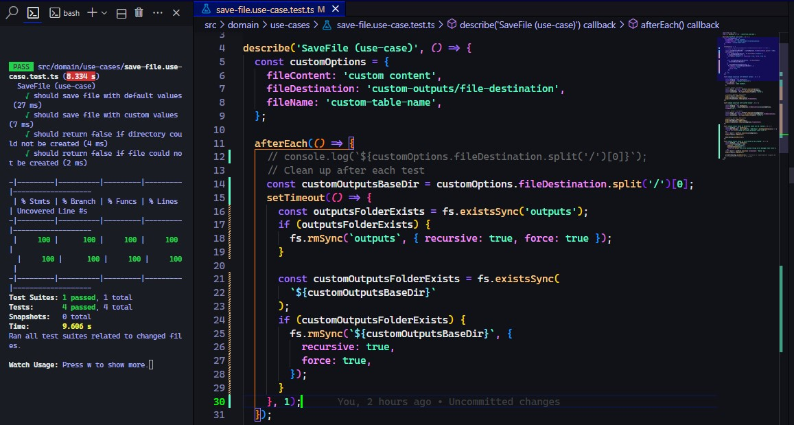
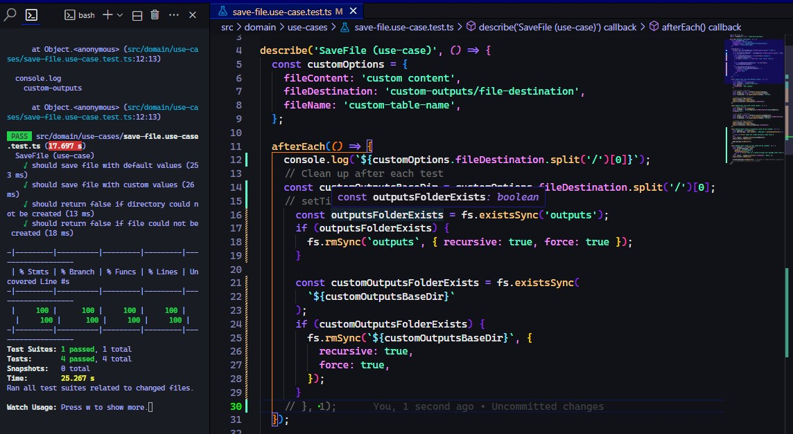
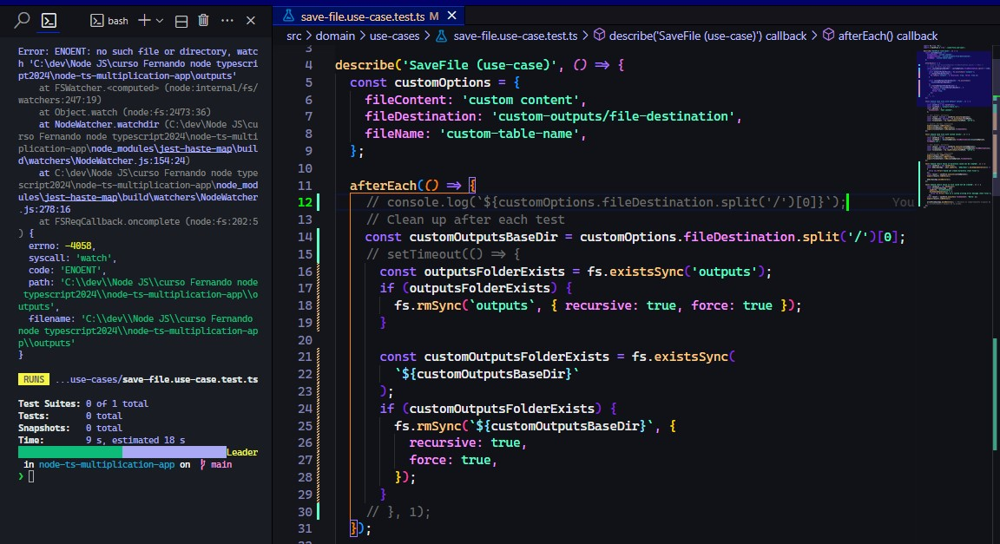

Me estaba dando un error:

```shell
[
  Error: EPERM: operation not permitted,
  lstat 'C:\dev\Node JS\curso Fernando node typescript2024\node-ts-multiplication-app\outputs\table.txt'
]
{
  errno: -4048,
  code: 'EPERM',
  syscall: 'lstat',
  path: 'C:\\dev\\Node JS\\curso Fernando node typescript2024\\node-ts-multiplication-app\\outputs\\table.txt'
}
```

o

```shell
{
errno: -4058,
syscall: 'watch',
code: 'ENOENT',
...
}
```

Me di cuenta que al colocar un console.log('something'); en el afterEach() o envolviendo lo del afterEach en un setTimeout no mostraba el error. Al parecer como son sincronas intenta borrar las carpetas antes que terminen los tests y por eso no tiene acceso ya que el test aun está haciendo uso de los directorios.

¿Como puedo resolver esto sin el console.log() o el setTimeout en el afterEach? Ya que este es más un parche que una solución real al problema subyacente.

(Aclaro que el repositorio usado fue descargado de la sección anterior, las funciones son las que hizo el profe Fernando, solo hice el test que comparto a continuación)

```typescript
import fs from 'fs';
import { SaveFile } from './save-file.use-case';

describe('SaveFile (use-case)', () => {
  const customOptions = {
    fileContent: 'custom content',
    fileDestination: 'custom-outputs/file-destination',
    fileName: 'custom-table-name',
  };

  afterEach(() => {
    // console.log(`${customOptions.fileDestination.split('/')[0]}`);
    // Clean up after each test
    const customOutputsBaseDir = customOptions.fileDestination.split('/')[0];
    setTimeout(() => {
      const outputsFolderExists = fs.existsSync('outputs');
      if (outputsFolderExists) {
        fs.rmSync(`outputs`, { recursive: true, force: true });
      }

      const customOutputsFolderExists = fs.existsSync(
        `${customOutputsBaseDir}`
      );
      if (customOutputsFolderExists) {
        fs.rmSync(`${customOutputsBaseDir}`, {
          recursive: true,
          force: true,
        });
      }
    }, 1);
  });

  test('should save file with default values', () => {
    // Arrange: Preparar
    const saveFile = new SaveFile();
    const filePath = 'outputs/table.txt';
    const options = {
      fileContent: 'test content',
    }; // Act: Actuar, estímulos

    const result: boolean = saveFile.execute(options);
    const fileExists: boolean = fs.existsSync(filePath);
    const fileContent = fs.readFileSync(filePath, 'utf-8'); // Assert: Afirmar, Aserciones

    expect(result).toBeTruthy();
    expect(fileExists).toBeTruthy();
    expect(fileContent).toBe(options.fileContent);
  });

  test('should save file with custom values', () => {
    // Arrange: Preparar
    const saveFile = new SaveFile();
    const filePath = `${customOptions.fileDestination}/${customOptions.fileName}.txt`; // Act: Actuar, estímulos

    const result: boolean = saveFile.execute(customOptions);
    const fileExists: boolean = fs.existsSync(customOptions.fileDestination);
    const fileContent = fs.readFileSync(filePath, 'utf-8'); // Assert: Afirmar, Aserciones

    expect(result).toBeTruthy();
    expect(fileExists).toBeTruthy();
    expect(fileContent).toBe(customOptions.fileContent);
  });

  test('should return false if directory could not be created', () => {
    const saveFile = new SaveFile();
    const mkdirSyncSpy = jest.spyOn(fs, 'mkdirSync').mockImplementation(() => {
      throw new Error('Could not create directory (test file)');
    });
    const result = saveFile.execute(customOptions);
    expect(result).toBeFalsy();

    mkdirSyncSpy.mockRestore();
  });

  test('should return false if file could not be created', () => {
    const saveFile = new SaveFile();
    const writeFileSyncSpy = jest
      .spyOn(fs, 'writeFileSync')
      .mockImplementation(() => {
        throw new Error('This is a custom writing error message (test file)');
      });
    const result = saveFile.execute({ fileContent: 'Hello' });
    expect(result).toBeFalsy();

    writeFileSyncSpy.mockRestore(); // Restaura el comportamiento original de fs.writeFileSync() después de la prueba.
  });
});
```

Capturas:

1. Con setTimeout pasan las pruebas:
   

2. Se comentó el setTimeout y se agregó un console.log() y tambien pasan las pruebas
   

3. Se comentó tanto el setTimeout como el console.log y da el error ENOENT y se sale del test:watch
   

AYUDA! 😥
